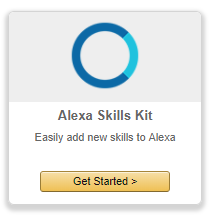
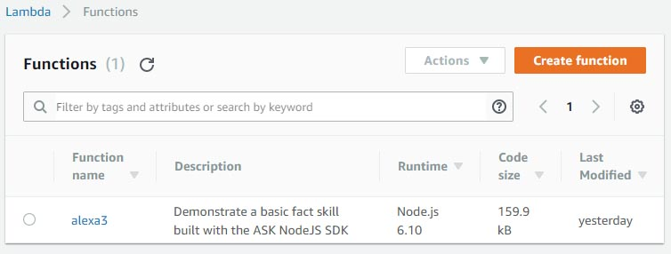
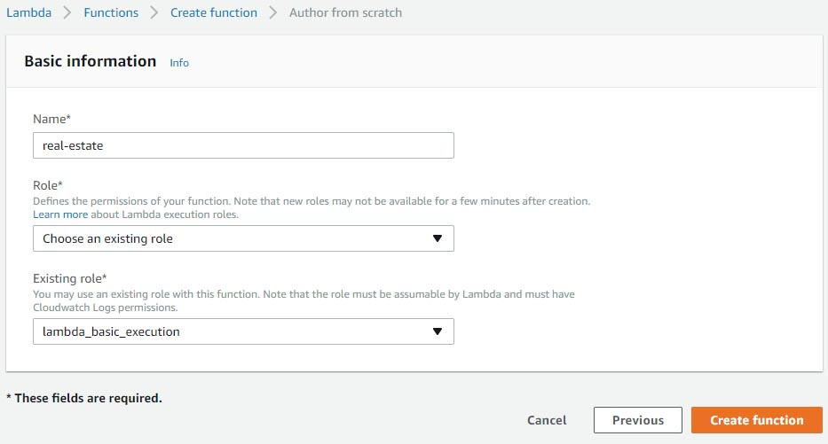
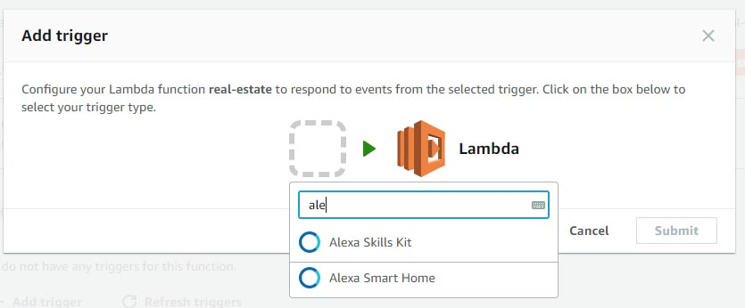

# Alexa Real estate agent prototype 🏡
This is a documentation for a prototype of Amazon Alexa skill with multiple interconnected states.

The idea was to create an Alexa Skill that guides a person through the process of buying or renting a real estate. Buying a real estate is high-risk situation and often a stressful one riddled with self-doubt and uncertainty. Alexa Real Estate Agent would help people structure their thoughts, introduce them to the important concepts, and give them advice on request. As a result, a person would be able to know what they want and why do they want it.

Sections:
1. Storyline - Detailed description of the whole storyline
2. Implementation of state machine - Technical details on how the state machine was implemented
3. How to replicate - Most important steps in replicating the skill

**Note** This code was tested with AWS Lambda (released on 2017-4-18) running Node.js 6.10. It may become outdated.

# 1. Storyline
The storyline depicted in the diagram provided here exactly matches the one in the code. Storyline consists of states, intentions and things Alexa should say while transitioning from one state to another.

Skill is using this intentions
* AMAZON.CancelIntent (required)
* AMAZON.HelpIntent (required)
* AMAZON.NoIntent
* AMAZON.StopIntent (require)
* AMAZON.YesIntent

where AMAZON.CancelIntent, AMAZON.HelpIntent, and AMAZON.StopIntent have been omitted from storyline for the sake of simplification.

There are also custom intentions
* Advice - Used when user is unsure or seeks help. Invocation examples: "I don't know.", "I'm not sure", "Can you help me out?"
* Error
* NumberOf{numericalValue} - Used for taking numerical inputs and storing them in a slot named "numericalValue". Invocation examples: "Five rooms", "One person"

Details of Advice and NumberOf implementations are mentioned in 2. How to replicate.

## 1.1. Storyline diagram
The following image explains the meaning behind graphics used in the diagram.


Next diagram depicts the whole storyline. Larger images and formats are provided as well.

📥Download 
[PNG HighRes (1.6 MB)](https://raw.githubusercontent.com/MiroslavJelaska/alexa-real-estate-agent/master/readme-resources/diagram-high-resolution.png)
|
[PNG MediumRes (600 KB)](https://raw.githubusercontent.com/MiroslavJelaska/alexa-real-estate-agent/master/readme-resources/diagram-medium-resolution.png)
|
[PDF (490 KB)](https://github.com/MiroslavJelaska/alexa-real-estate-agent/raw/master/readme-resources/diagram.pdf)
|
[AI (458 KB)](https://github.com/MiroslavJelaska/alexa-real-estate-agent/raw/master/readme-resources/diagram.ai)

[](https://raw.githubusercontent.com/MiroslavJelaska/alexa-real-estate-agent/master/readme-resources/diagram-medium-resolution.png "Click to open larger diagram")

## 1.2. Preview of the storyline in action
Here you can watch a part of a pitch where this prototype was used. It can give you a clear idea of how this storyline works in action. Pitch was given at "Let the machines talk" hackathon by FUNKE Digital GmbH (Berlin, Germany).

[](https://youtu.be/OKX5nA8ez_k?t=7m45s "Amazon Alexa skill pitch at Let the machines talk hackathon @Berlin")

# 2. Implementation of state machine
The idea was to create an Alexa Skill that guides a person through the process of buying or renting a real estate. From a voice assistant standpoint this meant building some kind of storyline and from a technical standpoint this meant building some kind of state machine. For each interaction with a user Alexa skill would go from one state to another.
For example, if in a current state Alexa could ask how many rooms a person wants to have in their new real estate. User could provide an exact number of rooms and trigger NumberOf intent, or he could trigger Advice intent by saying "I'm not sure.". Both intents, NumberOf and Advice, will change Alexa to another state appropriate for a storyline.

In case you are not familiar with Finite State Machines or State pattern I recommend exploring that topic before proceeding. This  documentation cannot fit a lecture on this topics but I will suggest few sources that might come in handy. Besides that you can surely find additional sources online.
Few sources:
 * [gameprogrammingpatterns.com > State pattern](http://gameprogrammingpatterns.com/state.html)
 * [sourcemaking.com > State pattern](https://sourcemaking.com/design_patterns/state)
 * [youtube > PatternCraft - State Pattern](https://youtu.be/yZt7mUVDijU)
 * [dotnetcodr.com > Design patterns and practices in .NET: the State pattern](https://dotnetcodr.com/2013/05/16/design-patterns-and-practices-in-net-the-state-pattern/)

There is only one active state and it's represented with global object called ```active```. This object contains all commands associated with current state. Commands are functions which are invoked for each of available intents e.g. ```yes()``` command which is invoked when ```AMAZON.YesIntent``` intent is invoked. There is also ```value()``` method which returns a [SSML](https://developer.amazon.com/docs/custom-skills/speech-synthesis-markup-language-ssml-reference.html) text that should be reproduced  by Alexa when the state is loaded, e.d. for ```welcome``` state Alexa will say ```Would you like to buy a house?```. Property ```id``` holds an unique ID for specific state. We find and replace states by their ID.

This is how one state looks like:
```javascript
{
    id: stateIds.roomSize_advice,
    value: function() {
        return 'To come up with a rough estimate, think about what your future needs will be. <break time="200ms"/> Current family size. Future family size. Do you have guests often? things like that. <break time="500ms"/> Is this enough information for you to take a guess?';
    },
    yes: function(){
        gotoState.call(this, stateIds.roomSize);
    },
    no: function(){
        gotoState.call(this, stateIds.roomSize_01_howManyPeople);
    },
}
```

All states are registered in object called ```stateCommands``` which serves as dictionary with stateId as key and command as a value e.g. ```stateCommands[stateIds.roomSize_01_howManyPeople]``` would return state object for state ```roomSize_01_howManyPeople```. To register a new state use ```addCommand(newCommand)``` function.

```javascript
function addCommand(newCommand){
    newCommand.stop = function(){
         gotoState.call(this, stateIds.exit, 'Ok, stoping now.');
    }
    newCommand.error = function(){
        gotoState.call(this, active.id, 'I didn’t hear you well');
    }
    stateCommands[newCommand.id] = newCommand;
}
```
This function not only registers a new state to the ```stateCommands``` dictionary but also adds some commands for ```stop``` and ```error``` which implementations are shared accross all of the states.

Once we have registered all of the states we should define what state is going to be used as an initial one. For that matter we use ```initState()```.

``` javascript
function initState(){
    active = stateCommands[stateIds.welcome];
    this.emit(':ask', active.value.call(this));
}
```
This method should be invoked inside 'NewSession' handler like so:
```javascript
'NewSession': function() {
        console.log('> NewSession');
        initState.call(this);
    },
```

To switch from one state to another use ```gotoState(nextState, textOnTransition)``` function. 
```javascript
function gotoState(nextState, textOnTransition){
    if(nextState === stateIds.exit){
        this.emit(':tell', textOnTransition);
    } 
    else {
        var response = active.value.call(this);
        var isDone = active.isDone;
        active = stateCommands[nextState];
        this.emit(':ask', (textOnTransition || '') +  active.value.call(this));
    }
}
```
This function enables you to transition to a next state. You can also define a ```textOnTransition``` - [SSML](https://developer.amazon.com/docs/custom-skills/speech-synthesis-markup-language-ssml-reference.html) text - that Alexa should reproduce before transition happens, but this parameter is optional. It works in a way that Alexa first reproduces ```textOnTransition``` and then a text for a newly active state ```active.value.call(this)```.

## 2.1. On using Function.prototype.call() in JavaScript
The state machine solution extensively uses ```Function.prototype.call()```. For an explanation of this topic take a look at following sources:
* [developer.mozilla.org > Function.prototype.call()](https://developer.mozilla.org/en-US/docs/Web/JavaScript/Reference/Global_Objects/Function/call)
* [You Don't Know JS : this & Object Prototypes > Chapter 2: this All Makes Sense Now! > Explicit Binding](https://github.com/getify/You-Dont-Know-JS/blob/master/this%20%26%20object%20prototypes/ch2.md#explicit-binding)

## 2.2. Debugging
For debugging purposes ```console.log()``` in combination with AWS CloudWatch Management Console can be used. CloudWatch Management Console provides Logs where you can investigate output from your ```console.log()``` along with other information, warnings, and errors.

# 3. How to replicate
These are just rough guides on how to replicate this skill and make it run. If you have no prior experience using [Alexa Skill Kit](https://developer.amazon.com/alexa-skills-kit) (aka ASK) I advise finding out more about it before proceeding on because this documentation is not meant to be used as introduction to Alexa Skill Kit and development.

## 3.1. Creating basic skill
1. Go to [https://developer.amazon.com](https://developer.amazon.com) > "Alexa"
2. Pick "Get Started >" from "Alexa Skills Kit"

 
3. Select "Add a New Skill" and fillout the "Skill information" tab as on the image below
 

4. Press "Save"
5. Press "Next" which will lead you to "Interaction Model" tab. Continue to 2.2. Inteaction model

## 3.2 Interaction model
1. Lanuch "Skill Builder" (which is curently in beta)
2. Go to "Code Editor" tab
3. Either upload interaction model JSON file or copy/paste content from provided interaction model. 📥 Download [interaction-model.json](interaction-model.json). This will provide you with all necessary intents.
4. Select "Build Model" (it will save model automatically)

## 3.3. Create Lambda for the skill
1. Go to [https://console.aws.amazon.com](https://console.aws.amazon.com)
2. AWS Lambda could possibly not be available in your current region. You can select "US East (N.Virginia)" to ensure you have it. Note: This is advice can become obsolite. Play around a bit with region setting if this doesn't work out for you.
3. Search and select "Lambda" from services

 

4. Press "Create function"
 
5. Press "Author from scratch"
 
6. Enter custom name and roles
7. Press "Create function"
8. "Configuration" tab > "Function code" paster source code from [main.js](main.js)
9. "Triggers" tab > "+ Add trigger" > Search for and select "Alexa Skills Kit" > Press "Submit"
 
10. Press "Save"
11. "Actions" > "Publish new version"
12. Copy ARN, we will need it for the steps that follow

## 3.4. Adding lambda to the skill
1. Head back to Amazon developer console page for your skill, somehow. (At the moment of writing this "Skill information" button in Skill Builder Beta works just fine).
2. Go to "Configuration" tab
3. Select "AWS Lambda ARN (Amazon Resource Name) Recommended"
4. Enter your ARN in the "Default" field
5. Select "Next"

If you've managed to find your way throught you should be ready to test and use the skill. Congrats! 🎉
