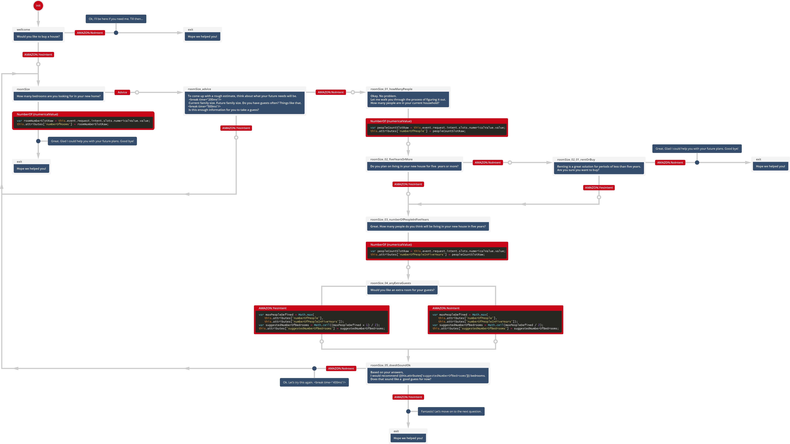
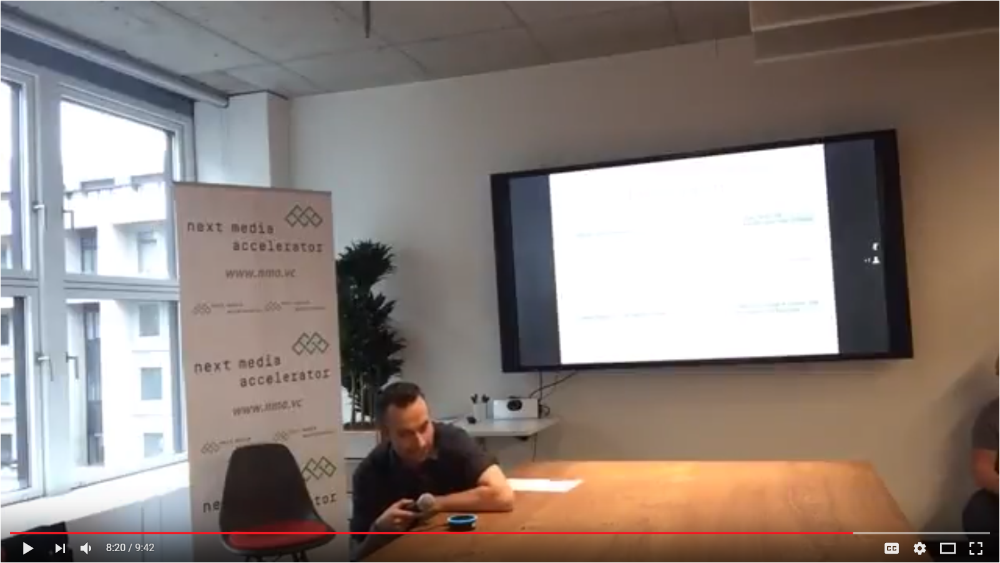

# Alexa Real estate agent protoype 🏡
This is a documentation for a prototype of Amazon Alexa skill with multiple interconnected states.

The idea was to create an Alexa Skill that guides a person through the process of buying or renting a real estate. Buying a real estate is high-risk situation and often a stressful one riddled with self-doubt and uncertainty. Alexa Real Estate Agent would help people structure their thoughts, introduce them to the important concepts, and give them advice on request. As a result, a person would be able to know what they want and why do they want it.

From a voice assistant standpoint this meant building some kind of storyline and from a technical standpoint this meant building some kind of state machine. For each interaction with a user Alexa skill would go from one state to another.
For example, if in a current state Alexa could ask how many rooms a person wants to have in their new real estate. User could provide an exact number of rooms and trigger NumberOf intent, or he could trigger Advice intent by saying "I'm not sure.". Both intents, NumberOf and Advice, will change Alexa to another state appropriate for a storyline.

Sections:
1. Storyline - Detailed description of the whole storyline
2. How to replicate - Most important steps in replicating the skill
3. Implementation of state machine - Technical details on how the state machine was implemented

**Note** This code was tested with AWS Lambda (released on 2017-4-18) running Node.js 6.10. It may become outdated.

# 1. Storyline

## 1.1. Storyline diagram

📥Download diagram:
[PNG HighRes (1.6 MB)](https://raw.githubusercontent.com/MiroslavJelaska/alexa-real-estate-agent/master/readme-resources/diagram-high-resolution.png)
|
[PNG MediumRes (600 KB)](https://raw.githubusercontent.com/MiroslavJelaska/alexa-real-estate-agent/master/readme-resources/diagram-medium-resolution.png)
|
[PDF (490 KB)](https://github.com/MiroslavJelaska/alexa-real-estate-agent/raw/master/readme-resources/diagram.ai)
|
[AI (458 KB)](https://github.com/MiroslavJelaska/alexa-real-estate-agent/raw/master/readme-resources/diagram.ai)

## 1.2. Preview of the skill in action
Here you can watch a part of a pitch where this prototype was used. It can give you a clear idea of how this storyline works in action. Pitch was given at "Let the machines talk" hackathon by FUNKE Digital GmbH (Berlin, Germany).

# 2. How to replicate

# 3. Implementation of state machine

